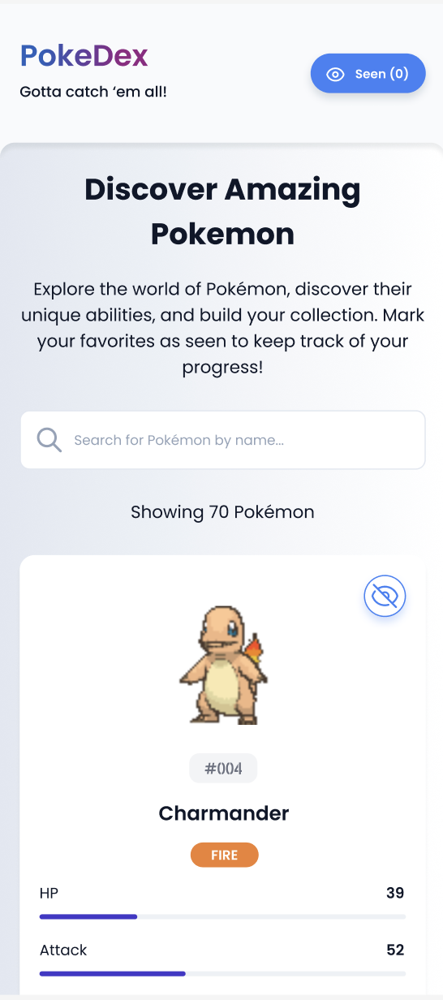
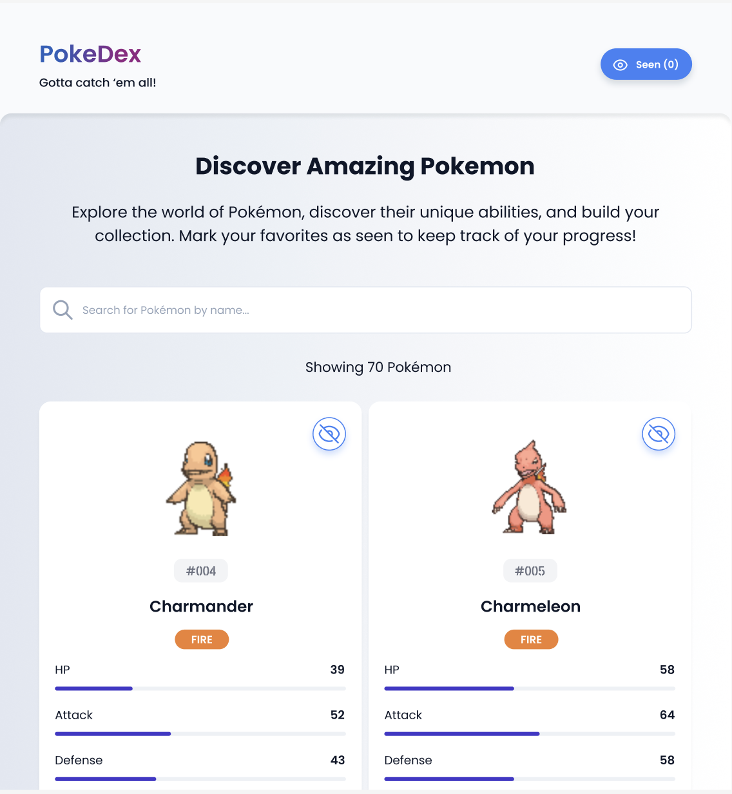
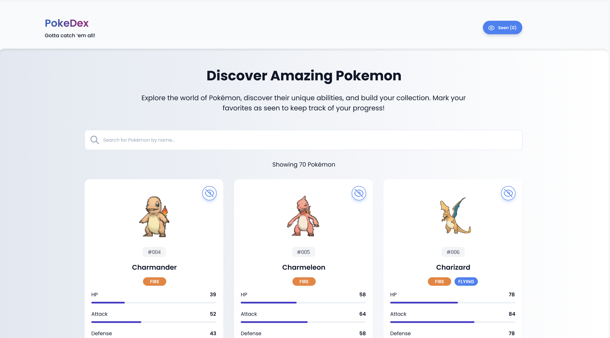
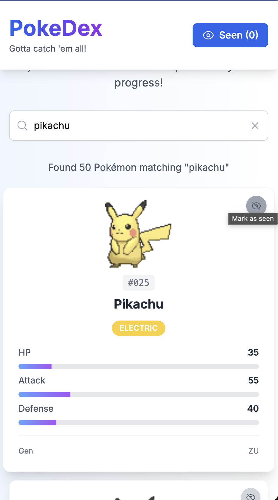
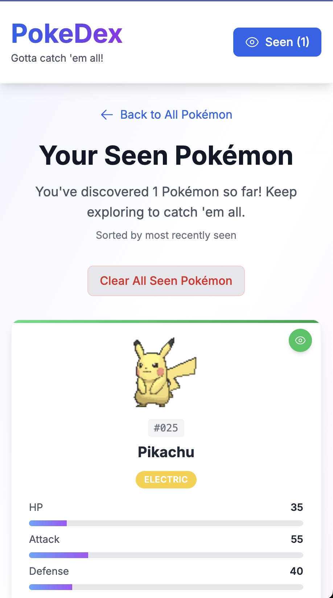
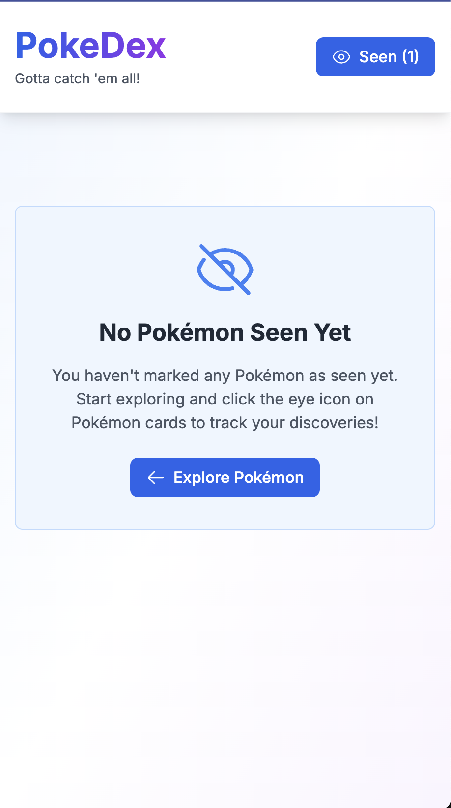
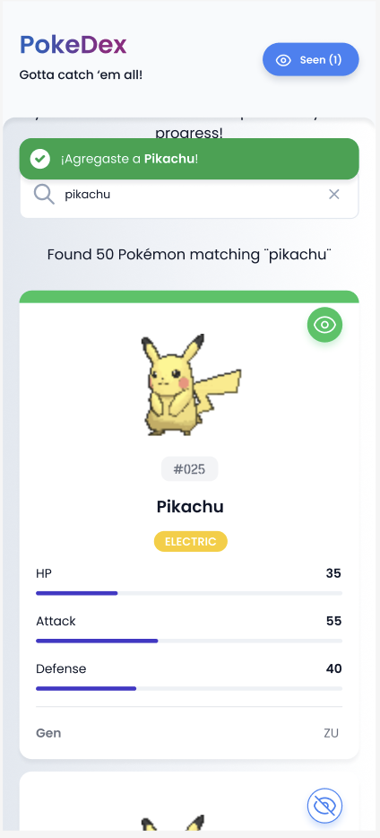

# PokeDex - Frontend Developer Test

¡Bienvenido al examen técnico para desarrolladores Frontend de Nilo! En este proyecto construirás un Pokédex moderno utilizando las tecnologías que manejamos en el equipo.

## 📋 Descripción del Proyecto

PokeDex es una aplicación web que permite a los usuarios explorar el mundo Pokémon, buscar sus favoritos y mantener un registro de los Pokémon que han "visto". El proyecto utiliza la API GraphQL pública de [favware/graphql-pokemon](https://github.com/favware/graphql-pokemon).

## 🚀 Tecnologías Utilizadas

- **Next.js 14+** - Framework de React con App Router
- **React 18** - Biblioteca de interfaz de usuario
- **TypeScript** - Tipado estático
- **Tailwind CSS** - Framework de estilos
- **Apollo Client** - Cliente GraphQL
- **GraphQL** - Lenguaje de consulta de datos

## 🛠️ Tareas del Examen

### Parte 1: Setup Inicial

1. **Instalación y configuración**
   - Clona el repositorio
   - Instala las dependencias con `npm install`
   - Ejecuta el proyecto con `npm run dev`
   - Verifica que la aplicación funcione correctamente
   - Acceso a los diseños en Figma: https://www.figma.com/design/TSdHT1wMVoJwsRaLf8djRD/Casos-entrevistas
   - Si no tenes permisos por favor hacenos saber mandandome un mail a jbadano@nilo-labs.com

### Parte 2: Diseño de la aplicación

2. **Layout & Navegación**

   - La aplicación consiste en 2 páginas, la home (ruta /) y la página de pokemones vistos (ruta /seen)
   - Diseñar el header basado en el diseño en Figma. Al scrollear por una página el mismo debe quedar fijo
   - La aplicación debe ser responsive como se muestra en las imágenes a continuación

 


3. **Home**

   - La home consta de un título, subtítulo, un cuadro de búsqueda y el listado de pokemones
   - Cada pokemon debe mostrar su foto, número o ID, nombre, tipo o tipos y los stats básicos (HP, Attack, Defense)
   - Para alimentar esta lista, vamos a usar el servicio de graphql indicado anteriormente [favware/graphql-pokemon](https://github.com/favware/graphql-pokemon)
     Nota: Podés usar un tamaño de página de 10 pokemones y como opcional usar offset=93 que es donde empiezan los pokemones clásicos.
   - Cada pokemon debe tener un botón de tipo toggle "Mark as seen/mark as unseen" que deberá agregar/eliminar al pokemon al listado del usuario. Los cambios se verán reflejados en el botón "seen" del header sumando/restando al valor númerico entre paréntesis.
     Nota: Este listado se almacenará en el navegador, por ende cuando refresquemos la página debería mantenerlo.
   - Al escribir en el cuadro de búsqueda debería filtrar los pokemones al menos por nombre

     

4. **Pokemones vistos /seen**

   - Esta página consiste en un botón para volver a la home, Título, descripción, botón para vaciar el listado y el listado de pokemones vistos por el usuario.
   - Al presionar el botón de vaciar deberíamos ver un mensaje como el de la foto de acá abajo.

    

### Parte 3: Mejoras y optimización

5. **Mejoras generales**

   - Debouncer: Usar el cuadro de búsqueda para filtrar a medida que se va escribiendo, implementar un delay para buscar solo cuando el usuario termine de escribir
   - Infinite Scroll: Implementar un sistema de paginado que a medida que vamos scrolleando hacia abajo busque más resultados y los agregue a la lista.
   - 404 y 500: Implementa las páginas de error 404 y 500.
   - Implementar un banner, cuando se agregue un pokemon se mostrará un banner flotando en la pantalla que indique que se agregó un pokemon al listado.

      

## 📚 API GraphQL

### Endpoint

```
https://graphqlpokemon.favware.tech/v8
```

### Consultas principales disponibles:

- `getAllPokemon(offset: Int, take: Int)` - Lista paginada de Pokémon
- `getPokemon(pokemon: PokemonEnum!)` - Detalles de un Pokémon específico
- `getFuzzyPokemon(pokemon: String!, take: Int)` - Búsqueda fuzzy de Pokémon

## 🚀 Comandos Disponibles

```bash
# Instalar dependencias
npm install

# Ejecutar en modo desarrollo
npm run dev

# Construir para producción
npm run build

# Ejecutar build de producción
npm start

# Verificar tipos de TypeScript
npm run type-check

# Ejecutar linter
npm run lint
```

## 💡 Consejos

- **Enfócate en la calidad sobre la cantidad** - Es mejor hacer menos funcionalidades pero muy bien implementadas
- **Usa los tipos TypeScript** - Aprovecha el tipado estático para escribir código más robusto
- **Piensa en la experiencia del usuario** - Considera estados de carga, errores, y casos edge
- **Mantén el código limpio** - Usa nombres descriptivos y mantén funciones pequeñas
- **Aprovecha Tailwind CSS** - Usa las clases utilitarias para crear interfaces consistentes, se valorará que se respete el diseño.
- **Estate atento a los detalles** - Revisa los detalles en Figma para que la aplicación cumpla fielmente con los diseños. https://www.figma.com/design/TSdHT1wMVoJwsRaLf8djRD/Casos-entrevistas

## 🆘 ¿Necesitas Ayuda?

Si tienes problemas técnicos o preguntas sobre el enunciado, no dudes en preguntar. Recuerda que también puedes consultar:

- [Documentación de Next.js](https://nextjs.org/docs)
- [Documentación de Apollo Client](https://www.apollographql.com/docs/react/)
- [Documentación de Tailwind CSS](https://tailwindcss.com/docs)
- [API GraphQL Pokémon](https://github.com/favware/graphql-pokemon)

## ⏰ Tiempo Estimado: 7 días

Cualquier consulta o si necesitas más tiempo escribime a jbadano@nilo-labs.com

¡Buena suerte y que disfrutes construyendo el PokeDex! 🚀✨
